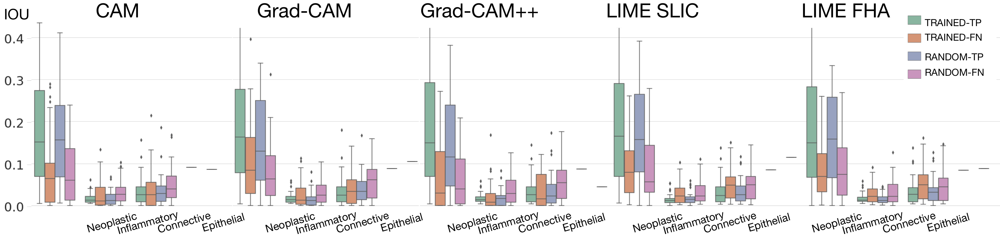

# XAI_evaluation
This repository contains the code and results of the paper "Evaluation and Comparison of CNN Visual Explanations for Histopathology",  to be presented at the XAI workshop at AAAI-21.

Visualization methods for Convolutional Neural Networks (CNNs) are spreading within the medical community to obtain explainable AI (XAI). The sole qualitative assessment of the explanations is subject to a risk of confirmation bias. 
This paper proposes a methodology for the quantitative evaluation of common visualization approaches for histopathology images, i.e. Class Activation Mapping and Local-Interpretable Model-Agnostic Explanations. 
In our evaluation, we propose to assess **four main points**:
1. the alignment with clinical factors
2. the agreement between XAI methods
3. the explanation consistency 
4. the explanation repeatability

To do so, we compare the intersection over union (IOU) of multiple visualizations of the CNN attention with the semantic annotation of functionally different nuclei types (see picture below).



The experimental results do not show stronger attributions to the multiple nuclei types than those of a randomly initialized CNN.

We show that [the visualizations hardly agree on salient areas](https://github.com/maragraziani/XAI_evaluation/blob/main/results/imgs/method_similarity.png) 
and LIME outputs have particularly [unstable repeatability](https://github.com/maragraziani/XAI_evaluation/blob/main/results/imgs/rep_1000samples.png) and [consistency](https://github.com/maragraziani/XAI_evaluation/tree/main/results).

**The qualitative evaluation alone is thus not sufficient to establish the appropriateness and reliability of the visualization tools.**

#### Dependencies
pip install -r requirements.txt

#### Citing this work
If you use this code in a scientific publication, we would appreciate references to the following paper:

**[1]  Graziani M., Lompech T., Müller H. and Andrearczyk V. "Evaluation and Comparison of CNN Visual Explanations for Histopathology" to be presented XAI workshop at AAAI-21.** 

Bibtex entry:
```latex 
@ARTICLE{graziani2021evaluation,
  title         = "Evaluation and Comparison of CNN Visual Explanations for Histopathology",
  author        = "Graziani, Mara and Lompech, Thomas and Müller, Henning and Andrearczyk, Vincent",
  month         =  feb,
  year          =  2021,
}
```

#### Acknowledgements
This  work  is  supported  by  the  European  Union’s  projects PROCESS (agreement  n.  777533),  ExaMode (n.  825292)and AI4Media (n. 951911). NVIDIA Corporation supportedthis work with the donation of the Titan X GPU.